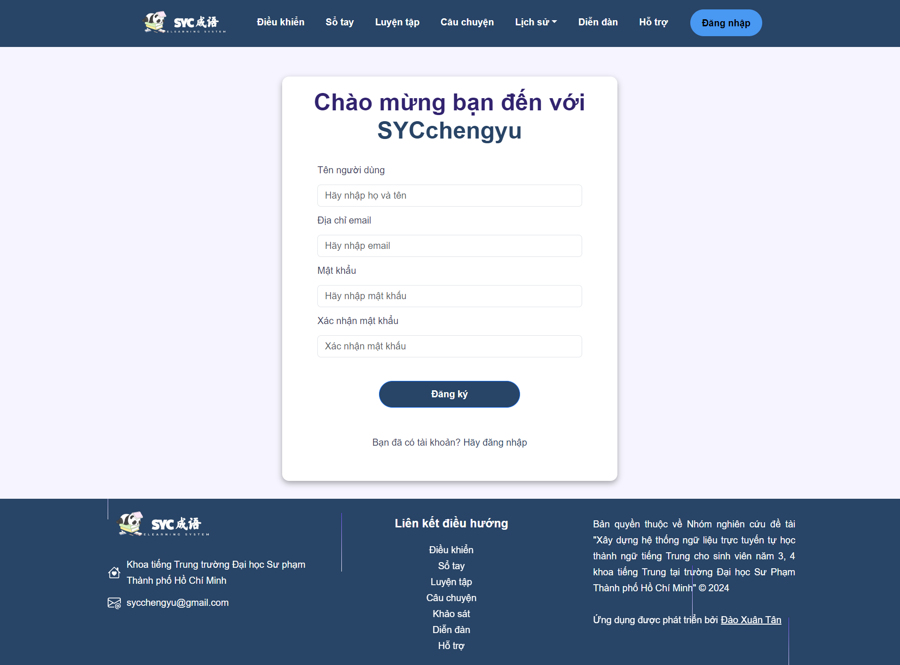

# Hệ thống Ngữ liệu tự học thành ngữ Tiếng Trung

## Giới Thiệu
Hệ thống ngữ liệu tự học thành ngữ là hệ thống được tạo ra nhằm đáp ứng nhu cầu tự học thành ngữ của sinh viên, kết hợp nhiều dạng bài tập và phân loại các thành ngữ với những mức độ khác nhau giúp người học dễ dàng tiếp cận và ghi nhớ nội dung.

Link: [sycchengyu.edu.vn](https://sycchengyu.edu.vn/)

## Tính Năng
- **Đăng ký/Đăng nhập**: Người dùng có thể tạo tài khoản mới hoặc đăng nhập vào tài khoản hiện tại.
- **Học thành ngữ**: Người dùng có thể xem danh sách thành ngữ và chọn 1 thành ngữ để xem chi tiết. Sử dụng Flashcard để ghi nhớ thành ngữ.
- **Bài tập**: Người dùng có thể thực hiện bài tập để kiểm tra mức độ ghi nhớ thành ngữ dựa trên các dạng bài tập khác nhau.

## Giao Diện

### Trang Đăng Nhập/Đăng Ký

- **Đăng Nhập**: Đăng nhập với các trường email và mật khẩu.

- **Đăng Ký**: Mẫu đăng ký với các trường tên, email, và mật khẩu.

### Trang Chính

### Bảng điều kiển

- **Thanh Điều Hướng**: Thanh điều hướng trên cùng cho phép truy cập nhanh đến các trang chính như Trang Chủ, Sổ tay, Bài tập, Audio câu chuyện và Diễn đàng.

### Trang sổ tay

- **Lọc thành ngữ**: Người dùng có thể tìm theo tên hoặc lọc theo loại thành ngữ.

### Trang thành ngữ

- **Nghe phát âm thành ngữ**: Người dùng có thể nghe phát âm thành ngữ bằng cách bấm vào biểu tượng loa, âm thanh được tạo bằng Azure speech.

- **Góp ý**: Người dùng có thể góp ý về bản dịch hoặc thông tin của thành ngữ.

- **Chuyển thành ngữ**: Người dùng có thể chuyển đến các thành ngữ được gợi ý.

- **Flashcard**: Người dùng có thể luyện tập ghi nhớ ý nghĩa, cách sử dụng của thành ngữ bằng flashcard.

### Trang câu chuyện thành ngữ
- **Nghe câu chuyện thành ngữ**: Người dùng có thể nghe câu chuyện thành ngữ bằng cách bấm vào biểu tượng loa, âm thanh được tạo bằng Azure speech.

### Trang lịch sử học thành ngữ

### Trang luyện tập 

- **Chọn dạng bài tập**: Người dùng có thể thực hiện bài tập bằng cách chọn 1 dạng bài và xem hướng dẫn làm bài. 

- **Chọn bài tập**: Người dùng chọn 1 bài tập để thực hiện

- **Làm bài tập**: Người dùng xem hướng dẫn và thực hiện bài tập

.png>)

.png>)

.png>)

.png>)

### Trang kết quả làm bài tập

